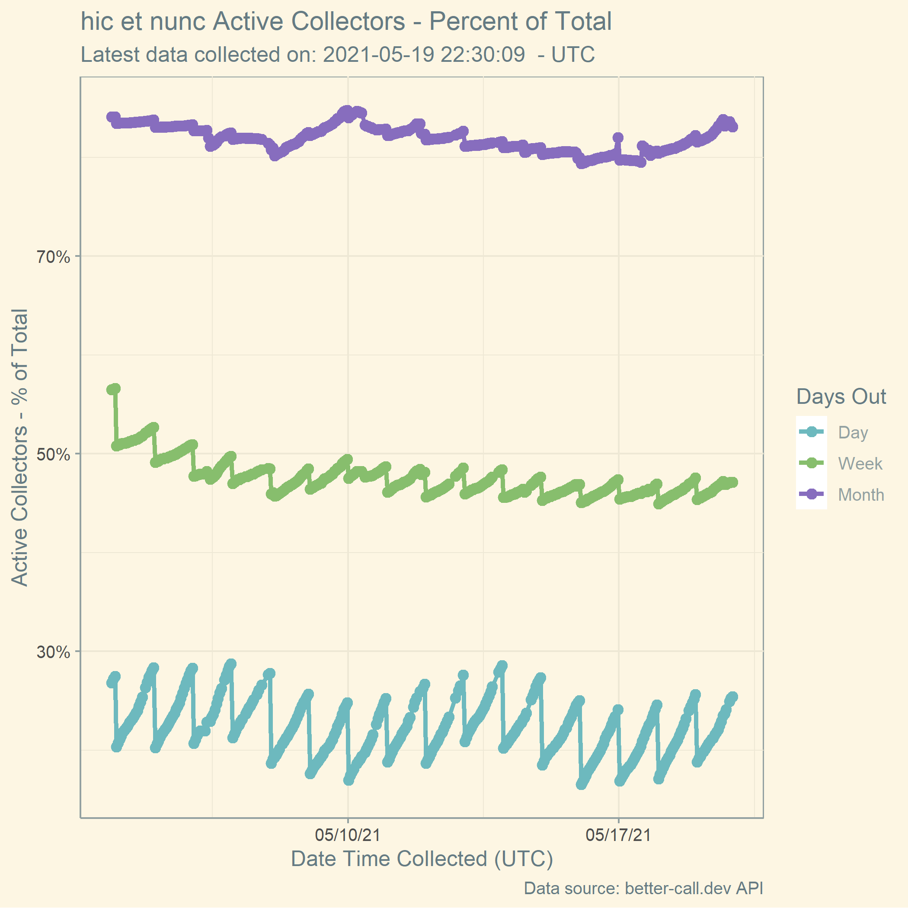
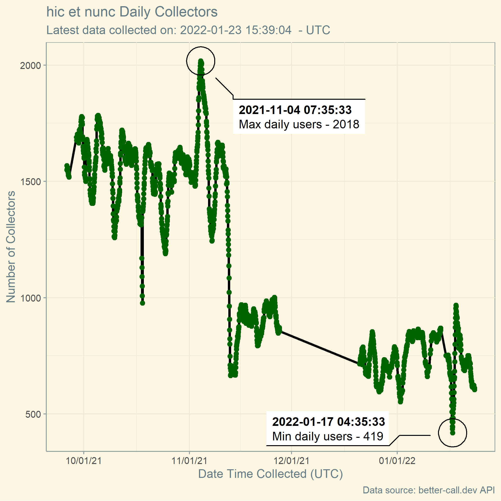
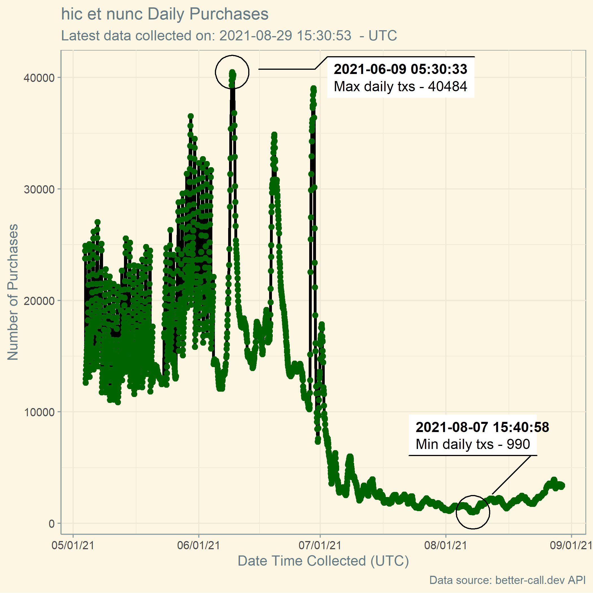
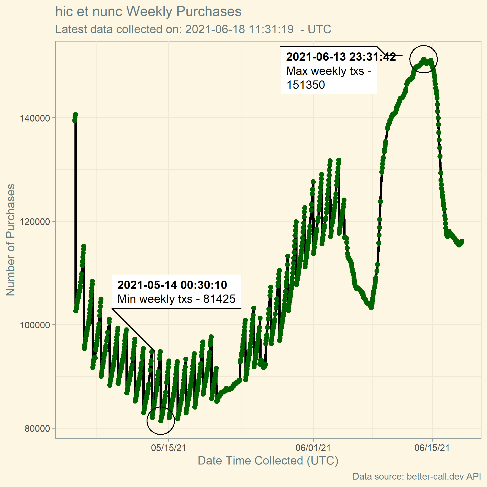
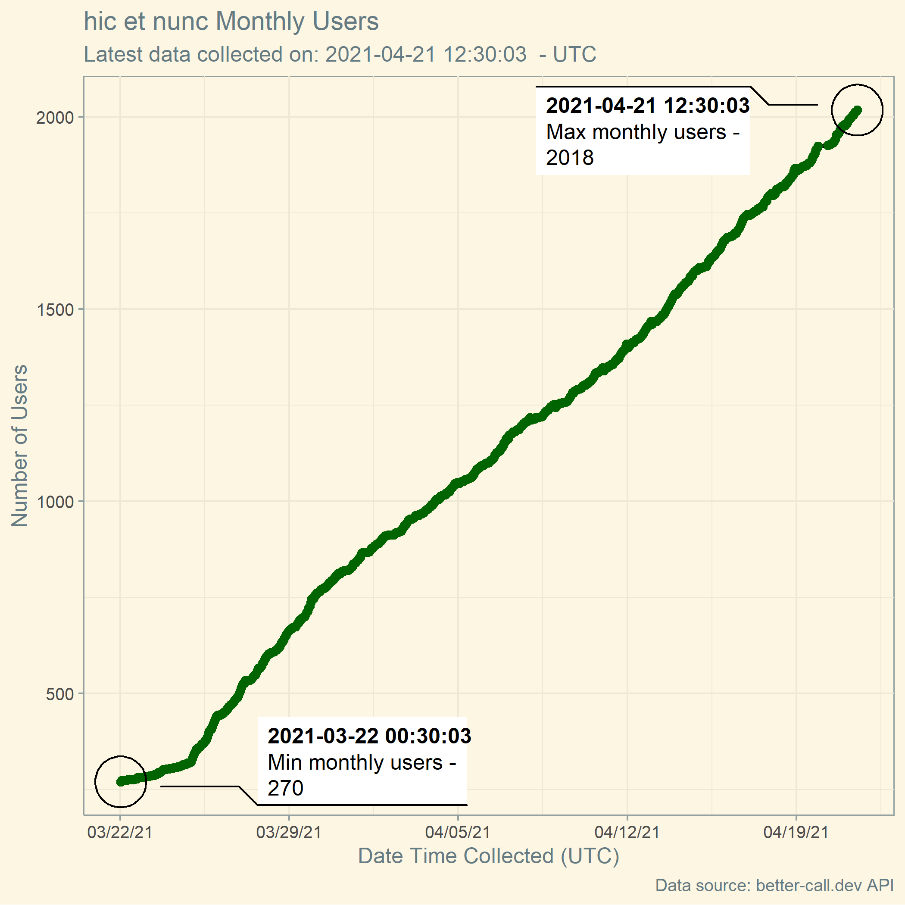
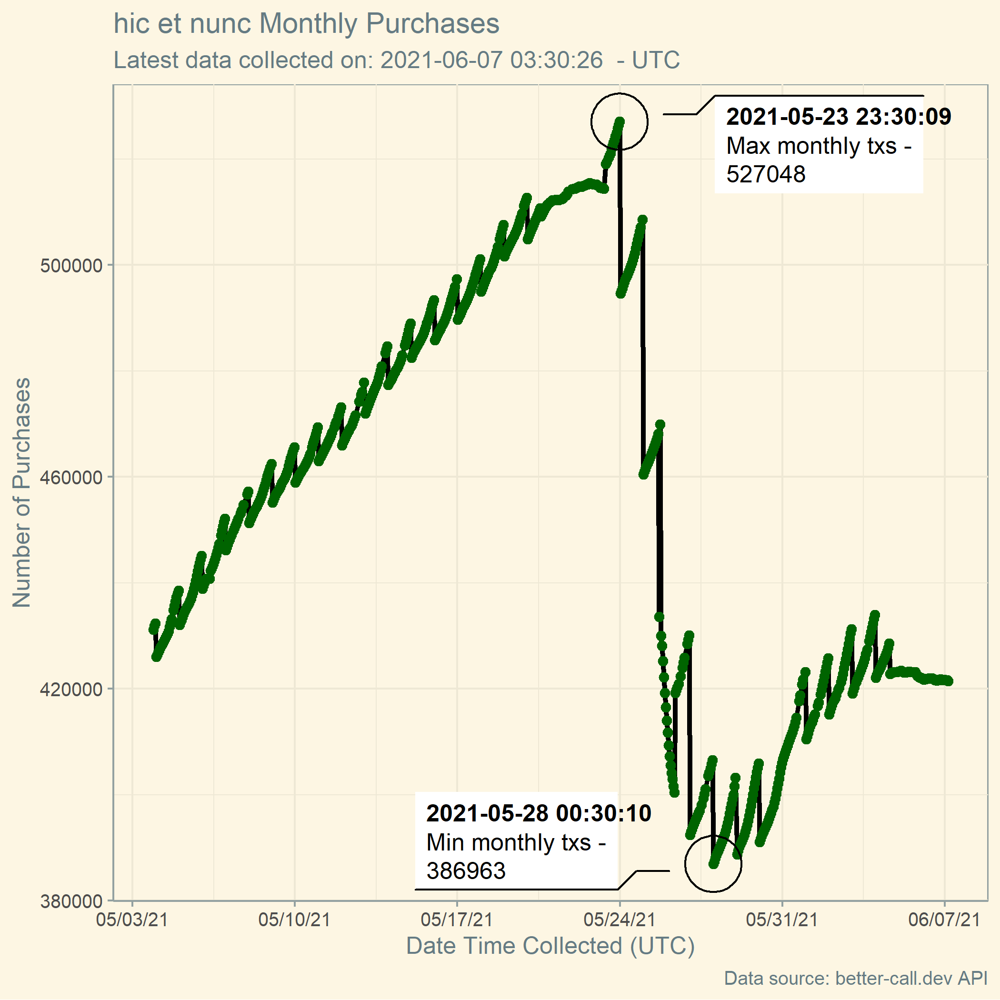
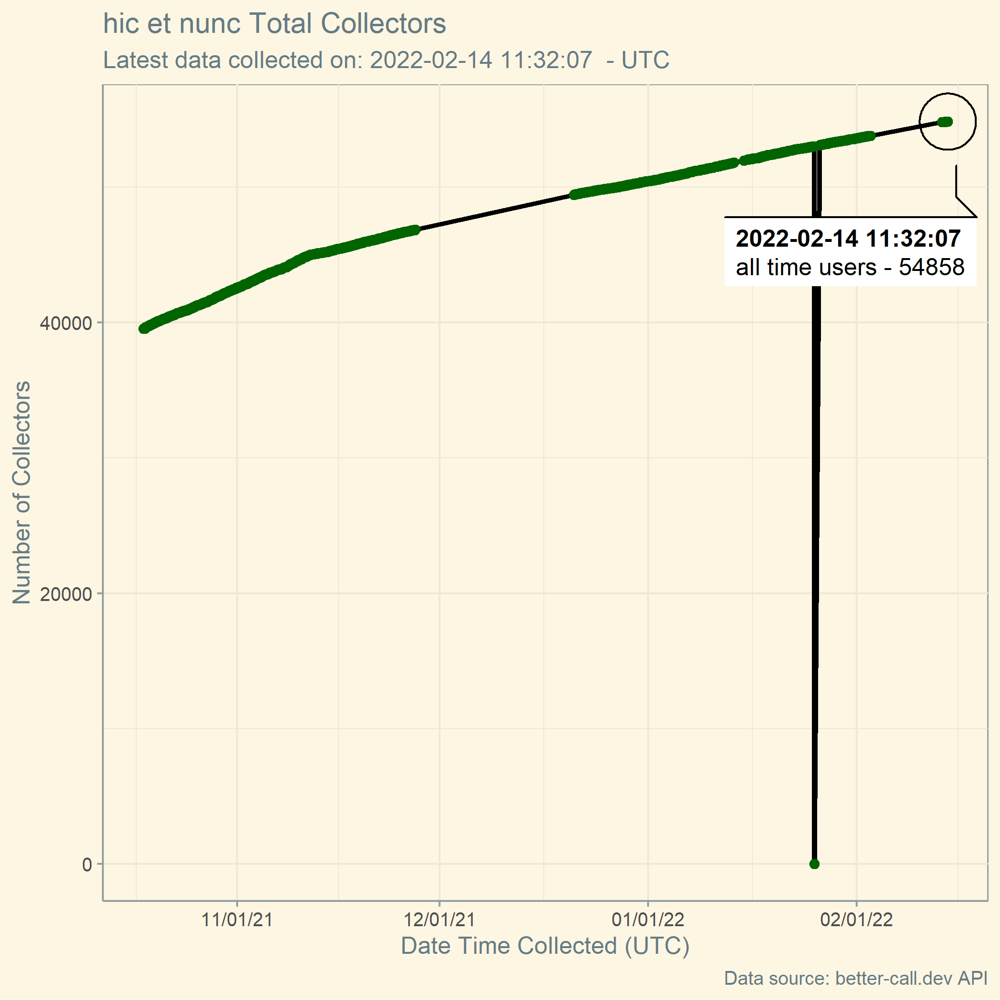
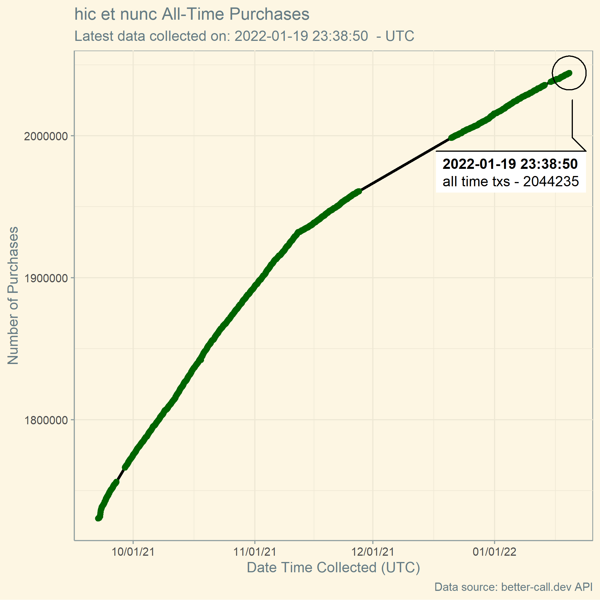

# NFTs-hicetnunc
A repository for automating NFTs posted to hicetnunc

### Percentage Active Users

 

### Daily users

  

### Daily transactions

  

### Weekly users

  

### Weekly transactions

  

### Monthly users

 

### Monthly transactions

 

### All-time users

 

### All-time transactions

 

## Next steps:

1. Try ggfx devtools installation through github actions and see if it works (will probably fail)

2. If #1 works, finalize the chart started on desktop (ggfx repo using `load_all`)

