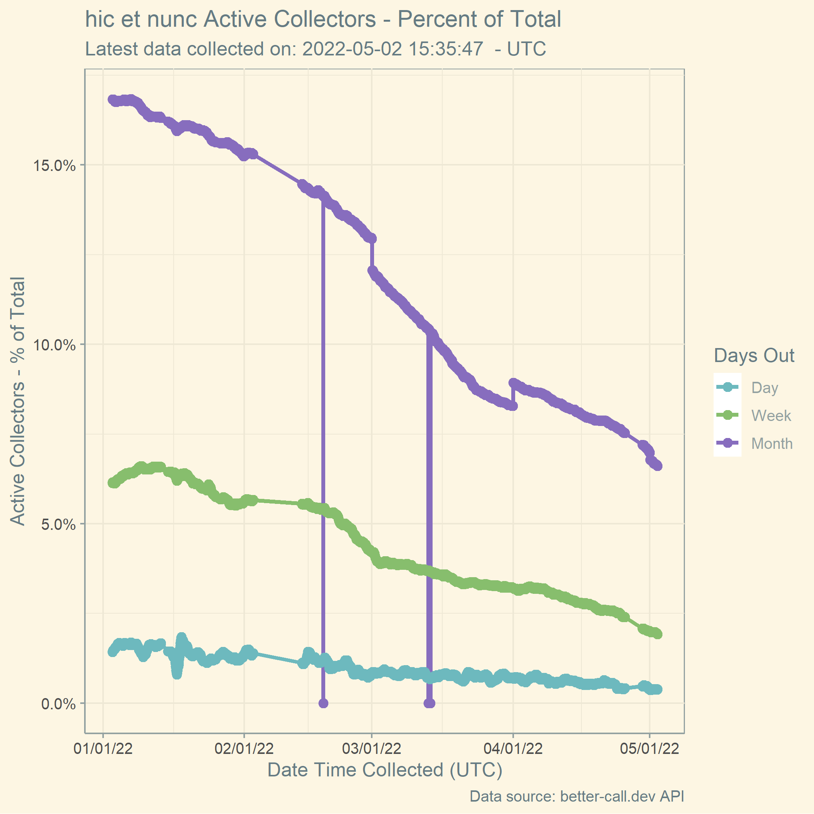
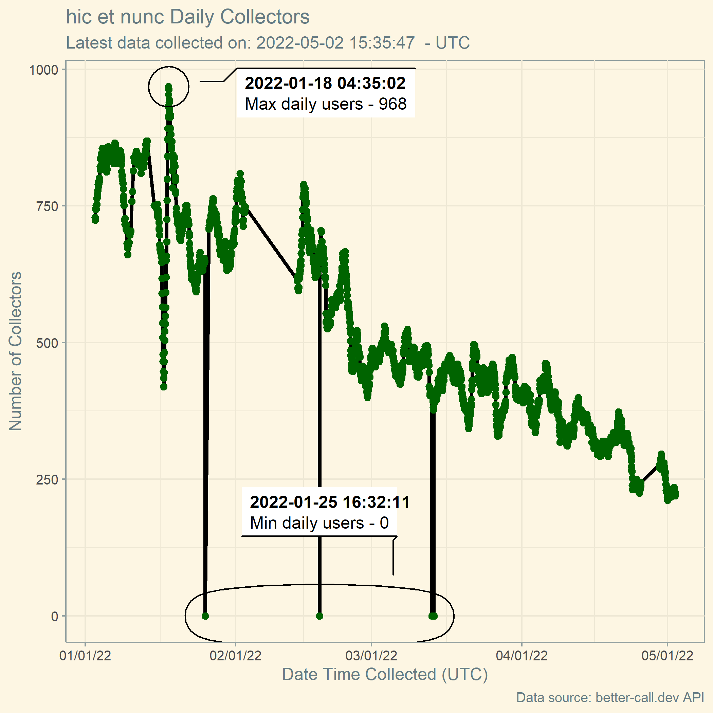
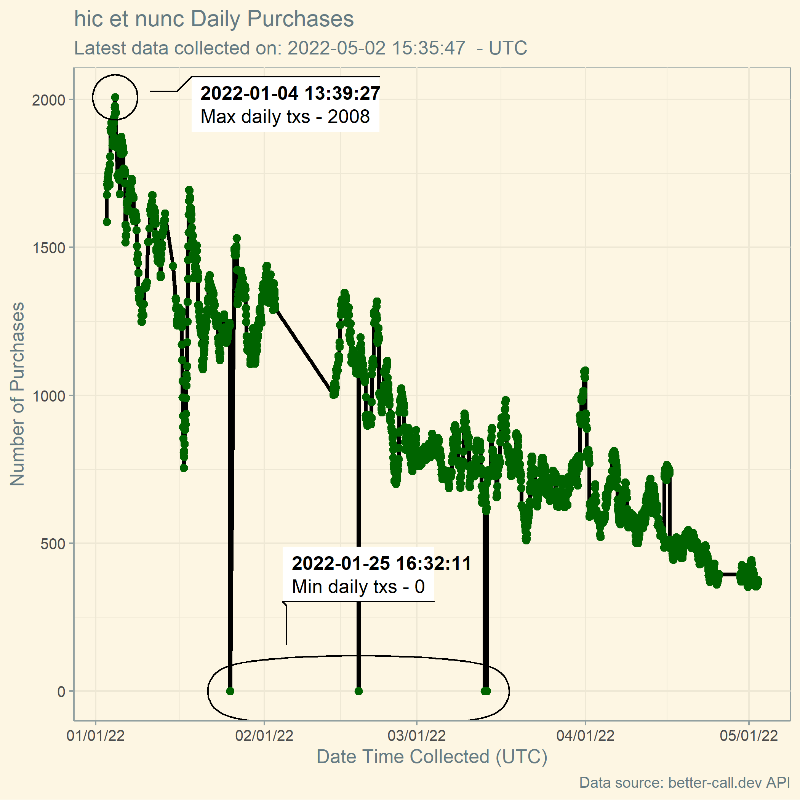
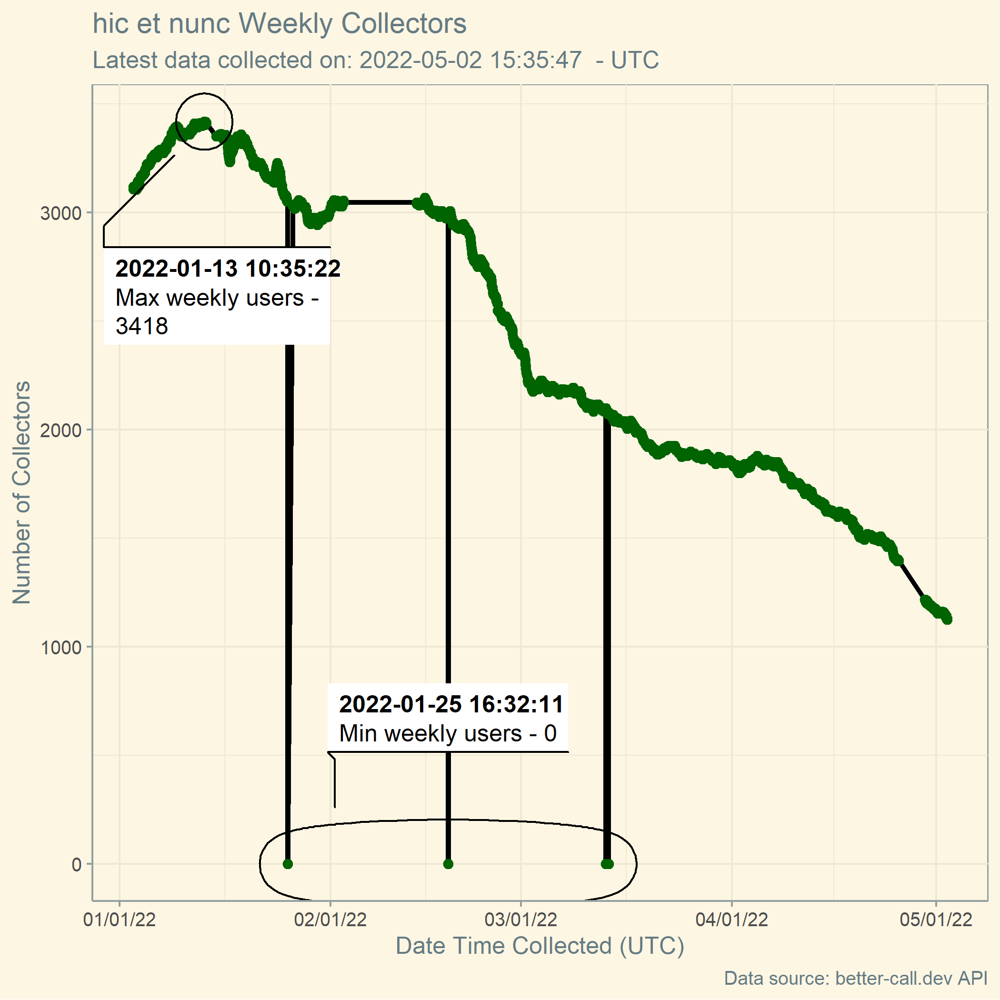
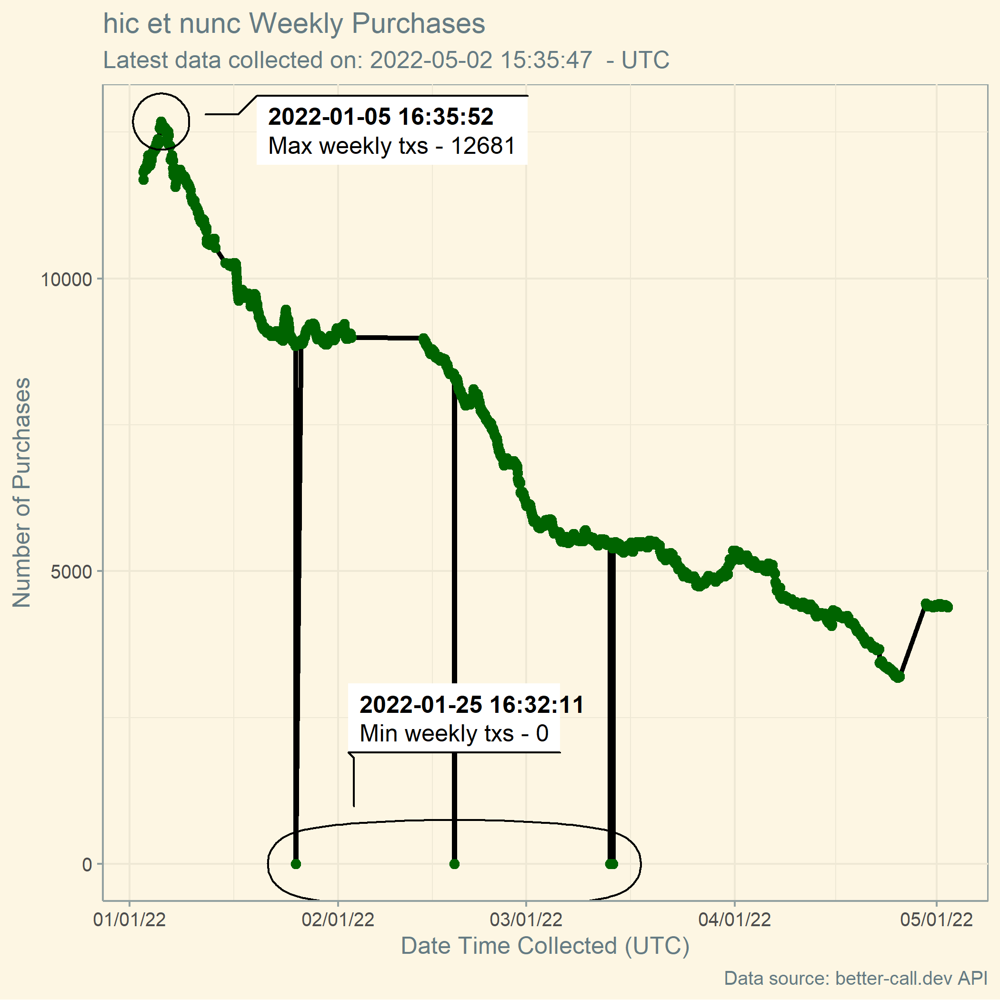
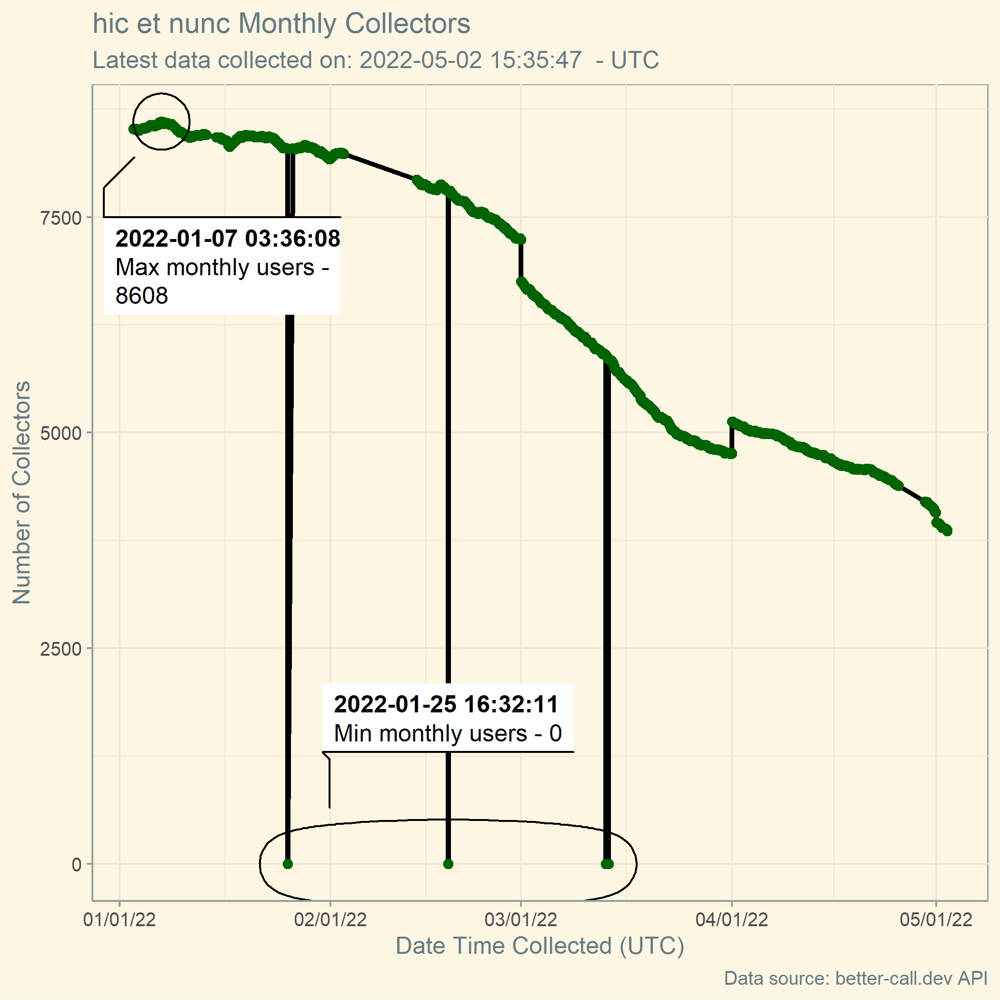
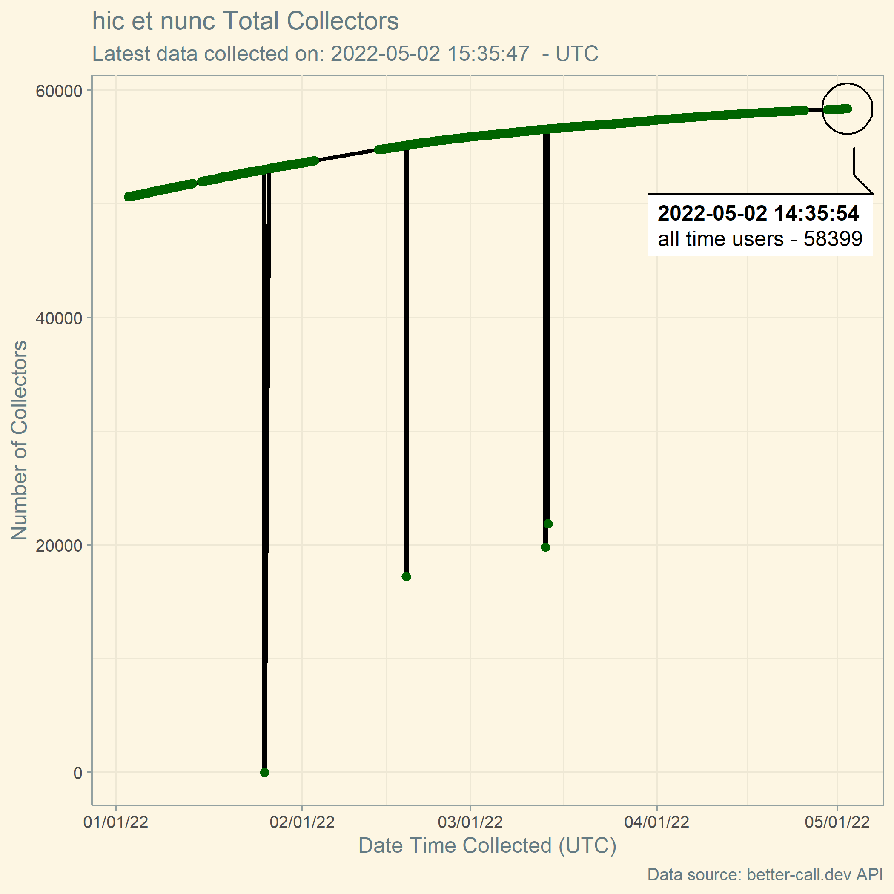

# NFTs-hicetnunc
A repository for automating NFTs posted to hicetnunc

### Percentage Active Users

 

### Daily users

  

### Daily transactions

  

### Weekly users

  

### Weekly transactions

  

### Monthly users

 

### Monthly transactions

 

### All-time users

 

### All-time transactions

 

The charts above are enabled by the [ggforce](https://ggforce.data-imaginist.com/) (for the annotations), [ggplot](https://ggplot2.tidyverse.org/) (for the charts), [scales](https://scales.r-lib.org/) (to adjust axis formats), [pins](https://pins.rstudio.com/) (for data transfer), and [ggthemes](https://yutannihilation.github.io/allYourFigureAreBelongToUs/ggthemes/) packages.

## Next steps:

1. Try ggfx devtools installation through github actions and see if it works (will probably fail)

2. If #1 works, finalize the chart started on desktop (ggfx repo using `load_all`)

3. Create comparisons to kalamint data, for example how many average transactions per number of users on day, week, month basis?

